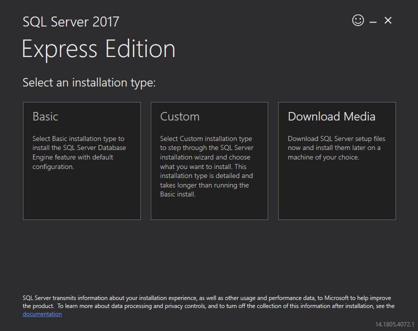
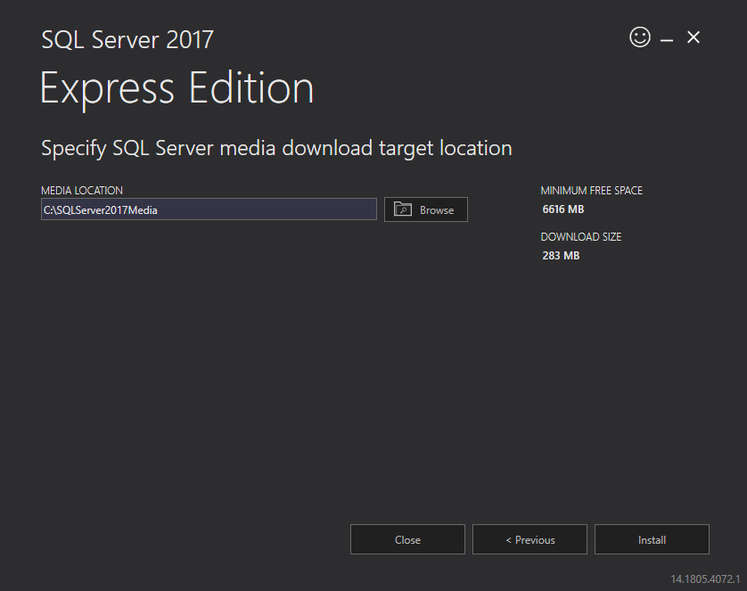
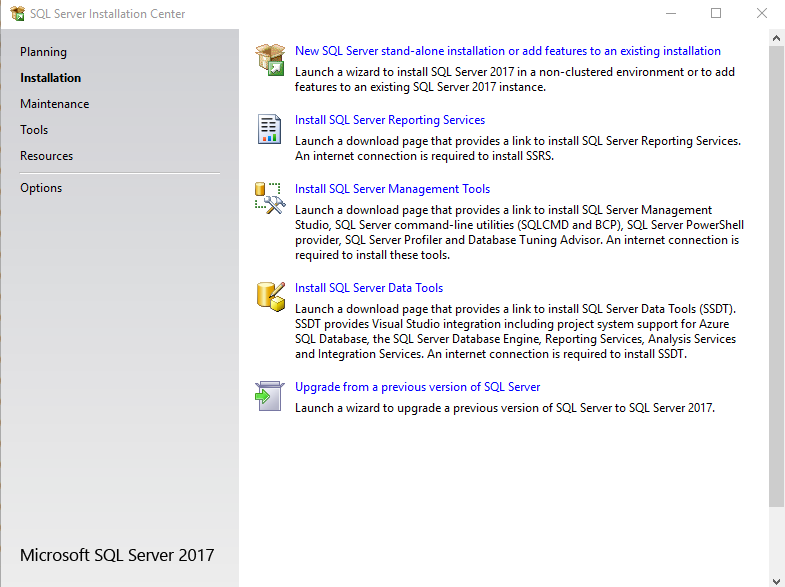
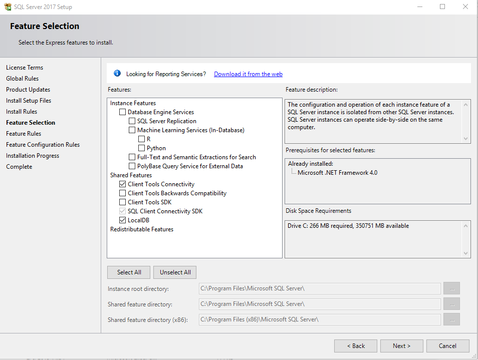
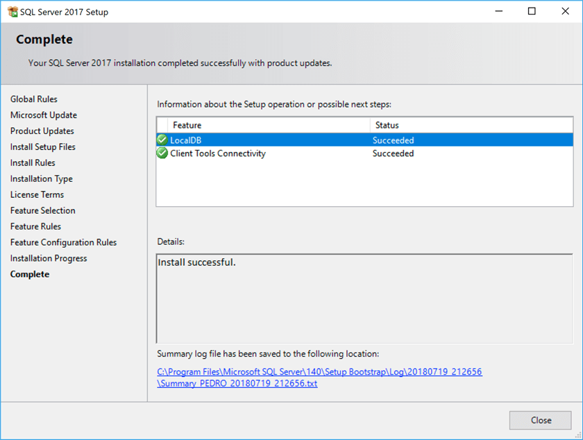
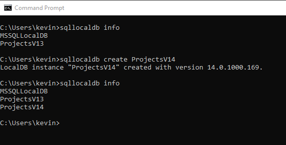
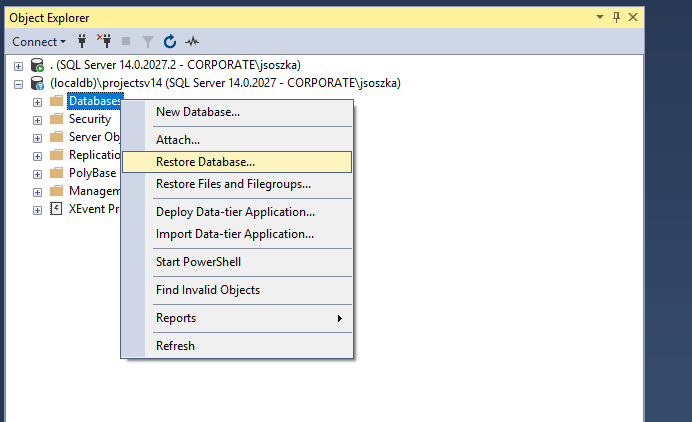
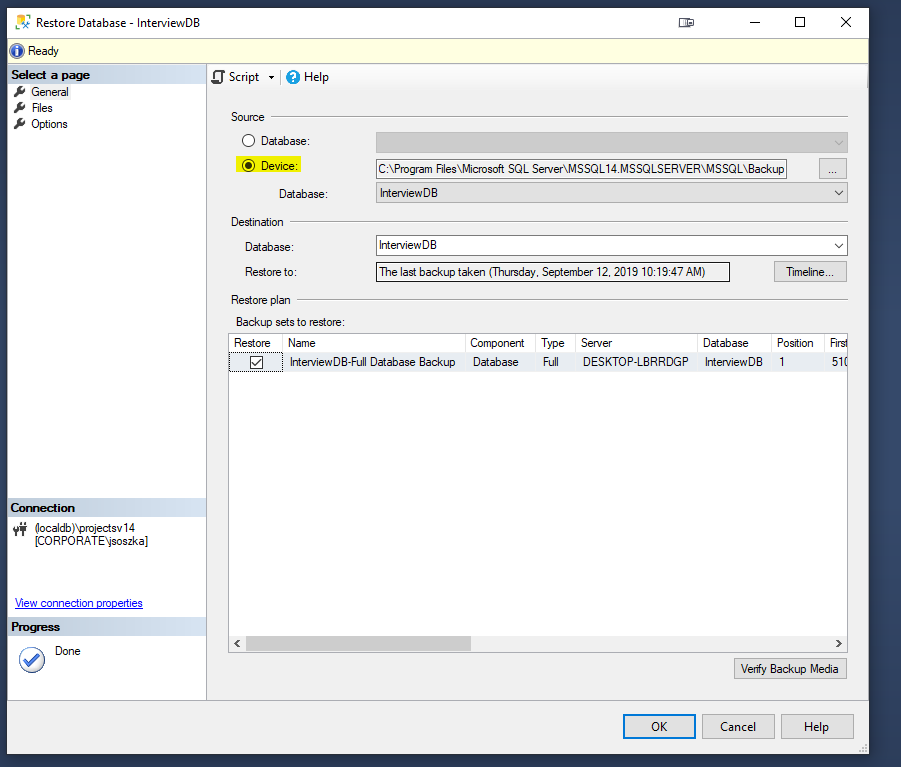

# Installing and Configuring SQL Server 2017 Express/LocalDB

[Back to Home](./README.md) > Installing and Configuring SQL Server 2017 Express/LocalDB

In order to successfully build and use a local copy of PMC databases you should be running SQL Server 2017 (V14).

## Instructions

###Configuring SQL Server

1. Download and run the SQL Server Express 2017 installer from here: https://www.microsoft.com/en-us/sql-server/sql-server-editions-express

2. Choose the Custom option


3. Choose a location to download the media and click Install.


4. Click on the `New SQL Server stand-alone installation` option


5. Accept the license terms, click next.
6. Click next on the Install Rules check (All should pass, it's ok if Windows Firewall is a warning)
7. On the Feature selection screen click the "Unselect All" button and then check the following options under the "Shared Features" section
   - Client Tools Connectivity
   - LocalDB


8. Click next, install and close on the completion screen


9. Open Command Prompt and run the following commands:
   - List existing LocalDB instances
   ```
   sqllocaldb info
   ```
   
   - Create a new instance with the lastest installed version of LocalDB
   ```sqllocaldb create ProjectsV14```

10. At this point you should be able to connect to your local database.
   

### Setting Up the Interview Database

1. Download `InterviewDB.bak` from the github repository.

11. Next, login to your local sql server. Once Logged in, Expand the server and right click on the databases folder then select restore
   

12. Finally Select device and point to the .bak file downloaded you downloaded from the repo


13. You should now be able to see the database and begin querying.

